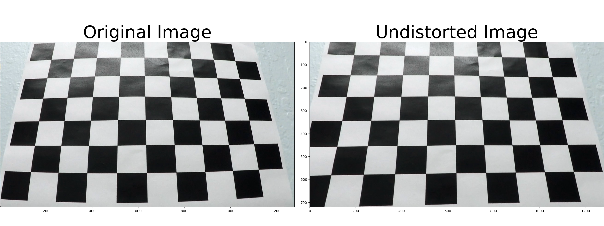
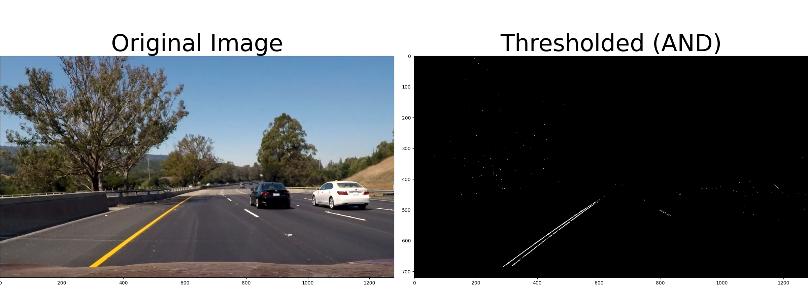
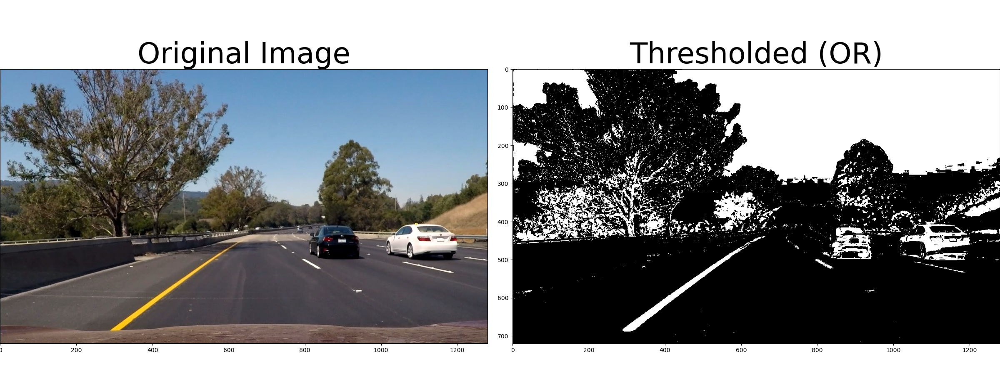
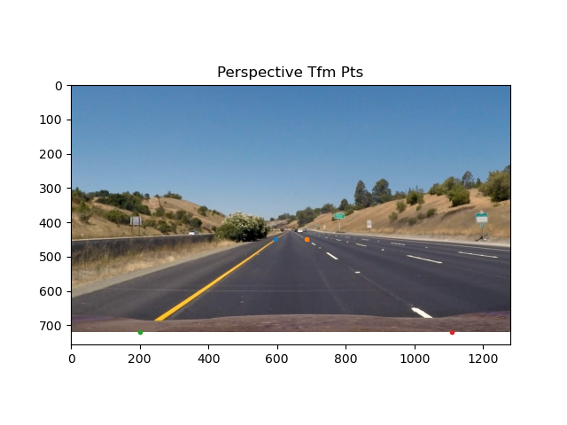
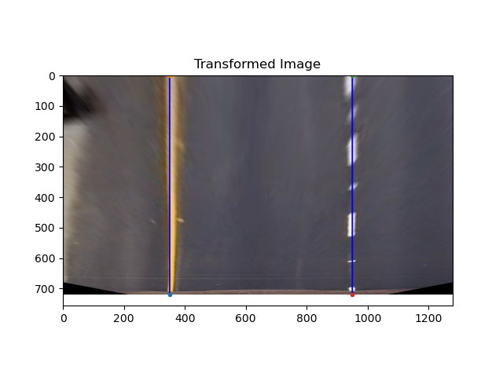
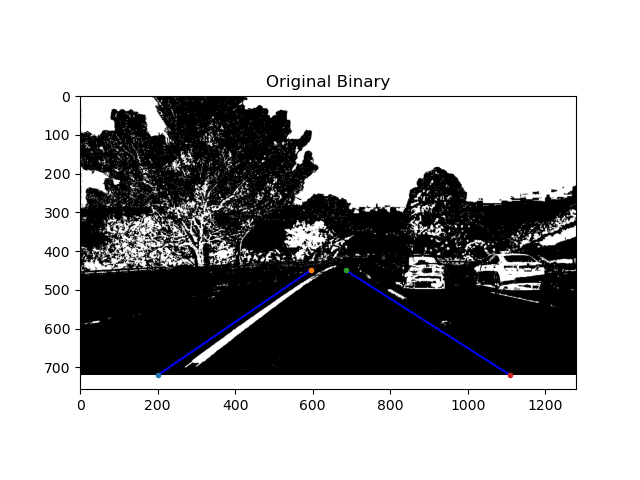
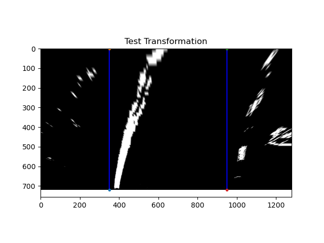
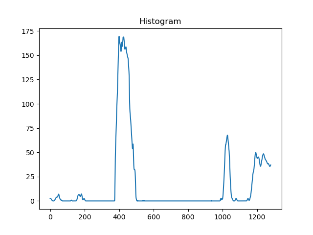
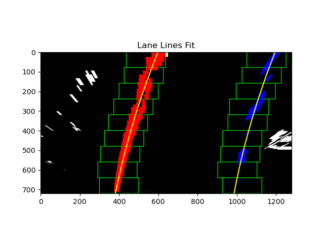

# Advanced Lane Finding using Computer Vision

This is a detailed description of a software pipeline that identifies lane lines in a video stream. See `src/main.py` for the main script that contains the pipeline.

# Project Output Slice

# Steps Explained
## Camera Calibration
First, I performed [camera calibration](https://docs.opencv.org/4.4.0/dc/dbb/tutorial_py_calibration.html) using chessboard images stored in `camera_cal/`:

See `src/calibrate.py` for the code.

## Gradient and Color Thresholding
Next, I performed thresholding using a combination of the x-gradient (using Sobel), the direction of the gradient, and the saturation of the image. Using saturation, or the S channel of HLS, is robust to variations in lighting. 

Note that using "AND", `&`, for combining the color and gradient threshold returns essentially _just_ the lane lines:

This might be useful, but we likely need more of the lanes, even if other elements of the image are picked up as well (we can mask later). Here is what it looks like using "OR", `|`, when combining: 

Here, the lane lines show up clearly. See `src/threshold.py` for the code.

## Perspective Transform (Bird's-eye view)
The next thing to do is to measure curvature. This is best done by looking at the lanes from a top-down view. Using a template image w/ relatively straight lane lines (`test_images/straight_lines1.png`), I performed a perspective transform using 4 manually derived source points from the image and mapping them to a warped, transformed image.

Here is the original image with the points (and lines) drawn: 

and here is the transformed image w/ the associated points: 

Here is what the transform looks like on an undistorted and thresholded image of a _curved_ road: 

Here, one can clearly see the right curvature of the road. Fortunately, despite the curvature, the lanes are still parallel, indicating the transform was done correctly. See `src/perspective_transform.py` for the code.

## Lane Identification and Fitting
TODO: add details
### Histogram Peaks

### Sliding Window Approach

#### Lane Lines Fit

