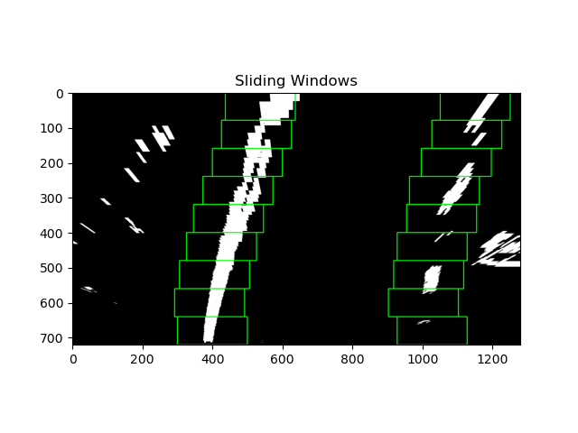

# Advanced Lane Finding using Computer Vision

This is a detailed description of a software pipeline that identifies lane lines in a video stream. See `src/main.py` for the main script that contains the pipeline.

# Project Output Slice
Click for full video:

# Steps Explained
## Camera Calibration
Images from cameras are naturally distorted as cameras transform 3D objects to 2D images resulting in objects appearing the wrong size or shape in the image. Camera calibration is a necessary step for self-driving cars to ensure we can accurately locate the car in the real, 3D world. I performed [camera calibration](https://docs.opencv.org/4.4.0/dc/dbb/tutorial_py_calibration.html) using chessboard images stored in `camera_cal/`:

See `src/calibrate.py` for the code.

## Gradient and Color Thresholding
Next, I performed thresholding using a combination of the x-gradient (using Sobel), the direction of the gradient, and the saturation of the image. Using saturation, or the S channel of HLS, is robust to variations in lighting. 

Note that using "AND", `&`, for combining the color and gradient threshold returns essentially _just_ the lane lines:

This might be useful, but we likely need more of the lanes, even if other elements of the image are picked up as well (we can mask later). Here is what it looks like using "OR", `|`, when combining: 

Here, the lane lines show up clearly. See `src/threshold.py` for the code.

## Perspective Transform (Bird's-eye view)
We can do a perspective transform that allows us to look at the lanes from a top-down view. This allows use to better see the curvature of the lane as well as allowing us to ignore objects that are in an irrelevant location. Using a template image w/ relatively straight lane lines (`test_images/straight_lines1.png`), I performed a perspective transform using 4 manually derived source points from the image and mapping them to a warped, transformed image.

Here is the original image with the points (and lines) drawn: 

and here is the transformed image w/ the associated points: 

Here is what the transform looks like on an undistorted and thresholded image of a _curved_ road: 

Here, one can clearly see the right curvature of the road. Fortunately, despite the curvature, the lanes are still parallel, indicating the transform was done correctly. See `src/perspective_transform.py` for the code.

## Lane Identification and Fitting
Now that our images are pre-processed, we can search for the lane lines.
### Histogram Peaks
First, we create a histogram that identifies where most of the highlighted pixels appear in the image (in terms of x). Here we can see the left lane pixels appearing around `x=400` and the right lane pixels appearing around `x=1000`. We choose the x values with the highest values to be the base of each lane line.

### Sliding Window Approach
Next, we search within a rectangular window for highlighted pixels and assign them to be part of the lane. We do this for each lane and search from bottom to top. Periodically, we re-center the window by taking the average of the assigned pixels which is what allows the window to shift side to side and follow the lines. 

#### Lane Lines Fit
Lastly, we fit two 2nd order polynomials to each line and plot the output of our lane prediction:

See `src.lane.py` for the full lane finding code.

## Optimization(s)
### Margin Search
Rather than conducting a window search for each frame, if we've successfully predicted previous frames, we can search within a sideways `margin` of the previously predicted lines. See `Lane.margin_search()`.

### Sanity Check
For each prediction, we ensure the width of the lane is reasonable. 

## Further Improvements
This pipeline struggles with shadows. It may be worth revisiting the thresholding code to try different combinations of color and gradients that may handle shadows better.

Additionally, the pipeline struggles with sharp curves. One way to improve how this is handled is to address what happens if a lane line turns "off" of an image. How could we adjust `window_search()` or `margin_search()` to handle this?